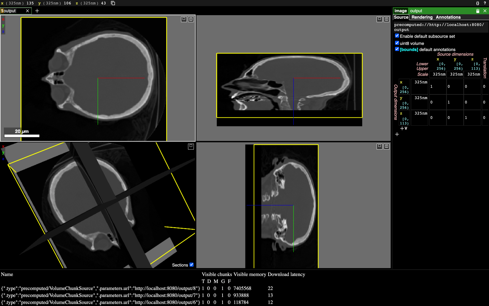
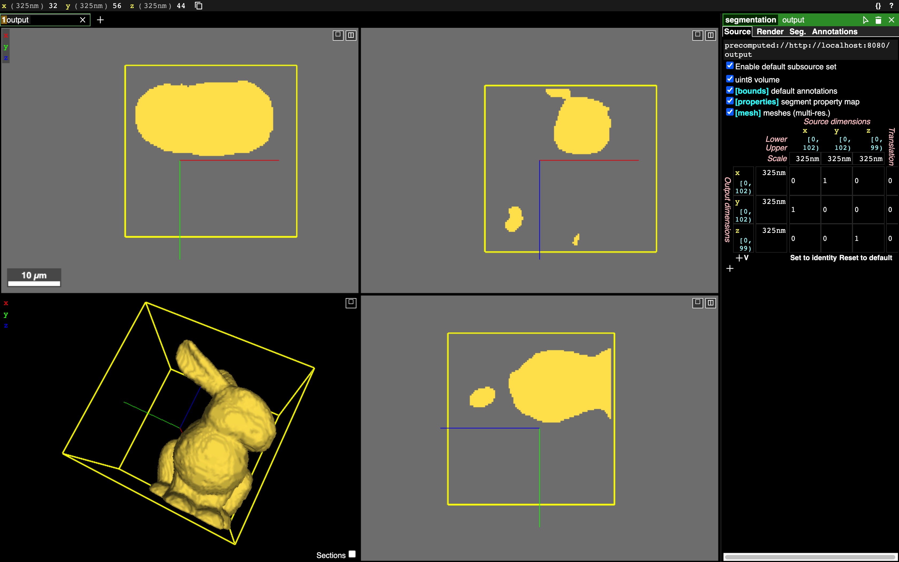

# Neurogen

Neurogen is a library for converting data into compatible formats with Neuroglancer.
The two types of outputs it can create are:
1) Volume generation
2) Mutli-resolutional meshes

**Installation**

After cloning the repository with `--recurse-submodules` run the following:

```Ubuntu
pip install neurogen
```

To set up a local Neuroglancer environment:
https://github.com/google/neuroglancer#building

**Volume Generation Example**

Working with the following example: http://graphics.stanford.edu/data/voldata/

Download example data and unzip in appropriate directory:
```Ubuntu
mkdir cthead
wget http://graphics.stanford.edu/data/voldata/cthead-8bit.tar.gz
tar xvf cthead-8bit.tar.gz -C cthead
```

Using Neurogen to generate the volume data:

```python
import os
import numpy as np
from imageio import imread
from neurogen import info as nginfo
from neurogen import volume as ngvolume

# Input and output directories.
input_dir = 'cthead/'
output_dir = 'output/'

#  Generate Input.
volume = np.zeros((256,256,113,1,1)).astype('uint8')
for filename in os.listdir(input_dir):
    imarray = imread(os.path.join(input_dir, filename)).astype('uint8')
    
    index = int(filename[11:14])
    volume[:,:,index,0,0] = imarray

# Generate Neuroglancer volume.
volume_info = nginfo.info_image(directory=output_dir, 
                                dtype=volume.dtype, 
                                chunk_size=[256,256,256],
                                size=volume.shape)

ngvolume.generate_recursive_chunked_representation(
    volume, 
    volume_info, 
    dtype=volume.dtype, 
    directory=output_dir,
    blurring_method='average'
)

```



**Mesh Generation Example (with Volume Generation)**

Download a high resolution version of the Standford Bunny from https://www.thingiverse.com/thing:11622 

```Ubuntu
wget https://cdn.thingiverse.com/zipfiles/f0/90/b2/26/36/High_Resolution_Stanford_Bunny.zip
unzip High_Resolution_Standford_Bunny.zip 
mkdir bunny_pngs
git clone https://github.com/cpederkoff/stl-to-voxel
python stl-to-voxel/stltovoxel.py High_Resolution_Stanford_Bunny/StanfordBunny_jmil_HIGH_RES_Smoothed.stl bunny_pngs/bunny.png
```

```python
import os
import imageio
import numpy as np

from neurogen import volume as ngvolume
from neurogen import mesh as ngmesh
from neurogen import info as nginfo

from skimage import measure

# Unzip tar  file into appropriate directory
input_dir = 'bunny_pngs/'
output_dir = 'output/'

#  Generate Input
volume = np.zeros((102,102,99,1,1)).astype('uint8')
for png in os.listdir(input_dir):
    im = imageio.imread(os.path.join(input_dir, png))
    index = int(png[5:8])
    volume[:,:,index,0,0] = im

ids = np.unique(volume[volume > 0])

info = nginfo.info_mesh(directory=output_dir, 
                        dtype=volume.dtype, 
                        chunk_size=[256,256,256],
                        size=volume.shape,
                        ids=ids,
                        labelled_ids = ['bunny'],
                        segmentation_subdirectory = 'segment_properties')

ngvolume.generate_recursive_chunked_representation(volume, 
                info, dtype=volume.dtype, directory=output_dir)

for segment_id in ids:
    # Generate mesh for each segment.
    vertices, faces, _, _ = measure.marching_cubes((volume[:,:,:,0,0] == segment_id).astype('uint8'), level=0, step_size=1)
    ngmesh.fulloctree_decomposition_mesh(vertices, faces, num_lods=1, segment_id=segment_id, directory=output_dir)
```


**License**
Neurogen is provided under an MIT license that can be found in the LICENSE
file. By using, distributing, or contributing to this project, you agree to the
terms and conditions of this license.
